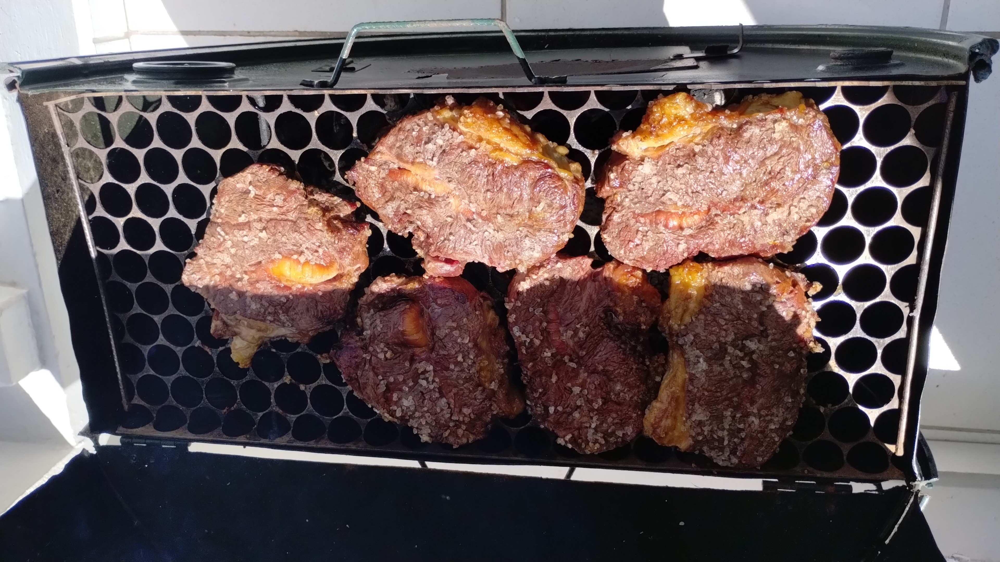

<!DOCTYPE html>

<html>

    <head>
<title>Título da Página</title>

    </head>

<body>

<h1>Lenine</h1>

<h2>Este e o meu primeiro HTML</h2>

<h1>Quando eu tinha cabelo.                                           Churrasco, que fome!.</h1>

</body>

 
</html>

